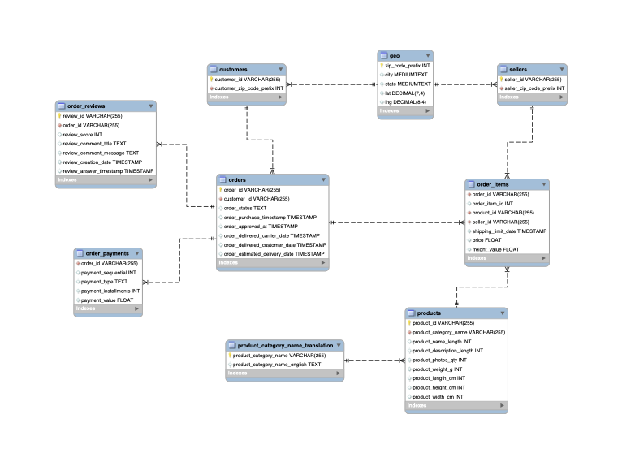

# Market analysis of Magist, an E-commerce platform from Brazil
## Description
The presentation is made for Eniac, an online marketplace specializing in Apple-compatible accessories. Eniac wants to expand into Brazil and wants to know whether Magist is a suitable partner for Eniac products.
For the market analysis, Magist sent a dataset of their sales in 2016-2018 to Eniac. 

The Magist DB has the following schema:

## Tasks:
- Assume the role of a data analyst
- Use SQL and Tableau to create a presentation and present it in front of Eniac CEO

## Business concerns 
This market analysis should answer two primary concerns raised by the management:
1. Is Magist a good fit for high-end tech products?
2. Are orders delivered on time?

## Solution steps
1. We first use SQL to create datasets - [Code here](code/SQL_code_final.sql)
2. Use Tableau to generate informative charts
3. Create a 4-minute presentation that answers the concerns above - [PPT here](https://github.com/sumitdeole/SQL-Tableau/blob/33a127cf8dabc51f7026e5c157c91cd45c16d749/Magist%20ppt.pdf).
4. Present it to the Eniac CEO in front of team members

> [!NOTE]
> This work is a collaborative effort between Guy, Jean, and Sumit.
